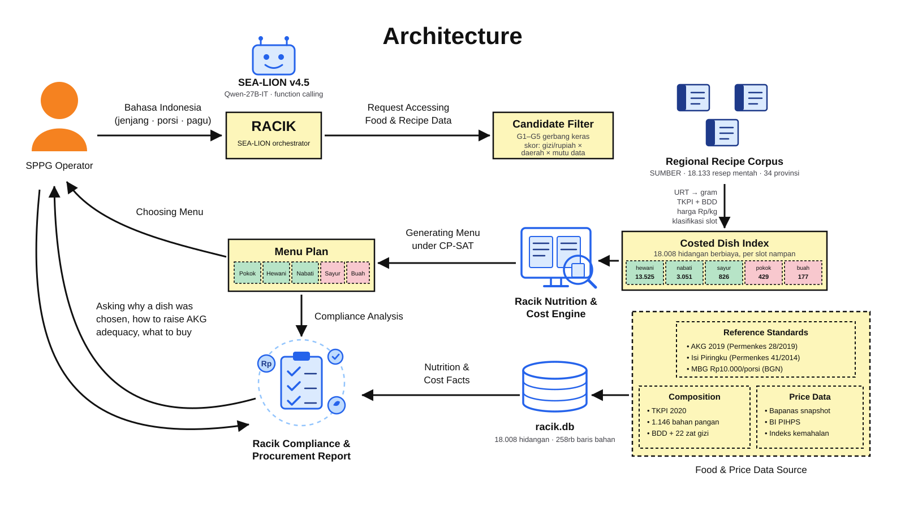

# Racik

An AKG-grounded, cost-constrained menu planner for Indonesia's **Makan Bergizi
Gratis** (MBG) program.

Racik takes 18,133 regional Indonesian recipes, converts their household-measure
ingredient lines into grams, prices and scores them against the official food
composition table, and then selects a multi-day menu with an integer programme
under AKG 2019 nutrient floors, the MBG per-portion budget, and the "Isi
Piringku" tray composition.

```bash
pip install -r requirements.txt boto3
python scripts/build_db.py                      # ~30 s, builds data/racik.db
export RACIK_LLM_PROVIDER=bedrock BEDROCK_MODEL_ID=...   # optional; see below
python -m uvicorn racik.api:app --port 8000     # then open http://127.0.0.1:8000
```

The styled operator frontend (`../index.html`, `../css/`, `../js/`) is served
at `/`; the plainer Indonesian-language reference UI stays at `/legacy`. No
LLM provider is required — without one, Agen Gizi, Agen Biaya, and the
orchestrator all fall back to a deterministic rule-based path.

---

## Architecture



Served at `/architecture.svg` when the app is running; source in
[`docs/architecture.svg`](docs/architecture.svg).

## What it actually does

```
Indonesian_Recipes_HF_Regional.xlsx   TKPI_2020_Table_4_All_Data.csv   prices_id.json
        18,133 recipes                    1,146 foods + BDD              Rp/kg
              │                                   │                         │
              ▼                                   │                         │
      racik/urt.py                                │                         │
      URT → grams                                 │                         │
      "2 ons ikan" → 200 g                        │                         │
      "1 papan tempe" → 200 g                     │                         │
      "secukupnya garam" → 2 g (flagged)          │                         │
              │                                   │                         │
              ▼                                   ▼                         │
      racik/tkpi.py ── token-set match ──→ composition + BDD                │
              │                                                             │
              ▼                                                             ▼
      racik/nutrition.py — edible g × per-100 g │ gross g × Rp/kg ──────────┘
      retention factors · frying-oil absorption · servings estimate
              │
              ▼
      data/racik.db     18,008 costed dishes, 257k audited ingredient lines
              │
              ▼
      racik/optimizer.py — CP-SAT
      AKG floors (soft) · budget cap (soft) · tray composition · variety
              │
              ▼
      racik/api.py + ui/index.html — plan, compliance, procurement, CSV
```

## The SEA-LION orchestrator

[SEA-LION v4.5](https://sea-lion.ai/) (AI Singapore, May 2026) is the natural-language
layer. It was picked over a general-purpose model for two reasons: it is trained
on Southeast Asian languages, so an SPPG operator can write ordinary Indonesian,
and it is tuned for "precise function-calling, structured JSON outputs, and
autonomous agentic tool-use" — which is the entire job here.

**The model orchestrates; it never calculates.** Every gram, rupiah, calorie and
adequacy figure is produced by the deterministic engine and handed to the model
as tool output. The system prompt forbids inventing numbers, and every response
carries the tool trace that produced them, so any claim can be checked against
the call behind it. An LLM that quietly rounded a protein figure would destroy
the one property that makes Racik worth using.

```
operator (Bahasa Indonesia)
        │
        ▼
  SEA-LION v4.5 ── decides which tools to call ──┐
  Qwen-27B-IT                                    │
        ▲                                        ▼
        └──────── tool results ──────── deterministic engine
                                        (CP-SAT · TKPI · prices)
```

| Tool | Returns |
|---|---|
| `plan_menu` | Optimised menu, per-day cost/adequacy, relaxed floors |
| `budget_sensitivity` | Adequacy and cost across several ingredient budgets |
| `search_dishes` | Candidate dishes by slot, province, cost, protein |
| `get_dish` | Per-portion nutrition, cost, ingredients with gram provenance |
| `procurement_list` | Aggregated shopping list scaled to headcount |
| `nutrition_reference` | AKG per-meal targets; enforced vs informational |
| `translate_dishes` | Indonesian dish names glossed to English, cached |
| `explain_candidates` | Which dishes were eligible, and which gate removed the rest |

**Bounded in code, not in the prompt.** A hard step cap (6) plus repeated-call
detection ends the loop; a stop condition that lives only in a prompt is one
that eventually does not stop. Failures — unknown tool, bad arguments, runaway
repetition — are recorded in the trace rather than swallowed.

**Degrades instead of failing.** With no `SEALION_API_KEY`, or if the API is
unreachable, a rule-based intent parser drives the same tools and returns the
same numbers. Narrower, still trustworthy, never a blank page.

```bash
curl -s localhost:8000/api/ask -H 'Content-Type: application/json' \
  -d '{"question":"Menu 5 hari untuk SMP di Jawa Tengah, 150 porsi, tanpa udang"}'
```

## Agen Gizi, Agen Biaya, and the Validator

`POST /api/generate` is the pipeline the styled frontend actually drives, and
it runs a fixed sequence rather than leaving the shape of the pipeline to a
model's tool choice — five stages every time, so a live demo never skips one:

```
Preprocessing (G1-G5 gates, unchanged)
        │
        ▼
  Agen Gizi ──┐          agents.py: one narrow, temperature-0 tool call each.
  Agen Biaya ─┤          Reads the operator's free-text notes / budget mode
              │          and returns *configuration knobs* — exclude_terms,
              │          enforce_micronutrients, ingredient_budget_share,
              │          regional_cost_index — plus a one-paragraph rationale.
              │          Never a gram, a rupiah, or an adequacy percentage:
              │          same "model orchestrates, never calculates" rule
              │          as the orchestrator above. No LLM configured? A
              │          conservative rule-based fallback answers instead,
              │          so /api/generate always completes.
              ▼
     MenuOptimizer.solve()      <- unchanged CP-SAT core
              │
              ▼
        Validator               agents.py: NOT an LLM call. Re-derives
                                 pass/fail per day straight from the solved
                                 PlanResult, so it can never disagree with
                                 the numbers /api/plan would show for the
                                 same solve.
              │
              ▼
   persisted run + menu plan   <- statedb.py
```

Every stage's rationale lands in the response's `trace` array, and the run is
persisted (`racik/data/racik_state.db`, separate from the read-only
`racik.db`) so three things the original engine had no memory of now work:

- **Operator review** — `POST /api/review` records an accept/reject + reason
  per day; a reject with `replace: true` re-solves just that day, excluding
  the rejected dishes.
- **Menu history / rotation** — every real (non-component) dish served is
  logged; the next `generate()` call excludes anything served in the last 14
  days by default (`history_days`), so a week doesn't quietly repeat itself.
  It decays rather than bans permanently: the exclusion is a rolling window
  read at solve time, not a persistent blacklist.
- **Stock & audit** — `POST`/`GET /api/stock` records received %, used %,
  actual cost, and a note per ingredient per day, against the same
  TKPI-deduplicated ingredient list `/api/generate`'s embedded procurement
  breakdown already computed — so "planned" never disagrees between the
  Procurement and Stock & Audit tabs.

```bash
curl -s localhost:8000/api/generate -H 'Content-Type: application/json' \
  -d '{"days":5,"portions":120,"province":"Jawa Tengah","budget_mode":"total","budget_value":3500000,"notes":"tanpa udang"}'
```

Model ids come from the [SEA-LION API docs](https://docs.sea-lion.ai/): the hosted
`https://api.sea-lion.ai/v1` endpoint is OpenAI-compatible and serves
`aisingapore/Qwen-SEA-LION-v4.5-27B-IT`, documented at 10 requests/minute — the
client self-throttles and backs off on 429. Point `base_url` at any
OpenAI-compatible server to self-host instead (for example
`aisingapore/Gemma-SEA-LION-v4.5-E2B-IT`, published on HuggingFace for local
deployment). The client is built on `urllib`, so the orchestrator adds **no new
dependency**.

## Why a dish was, or was not, chosen

Pre-filtering is two stages, and `POST /api/candidates` returns both plus their
effect — the question "why was this dish never considered?" has an answer.

**Hard gates.** A dish failing any of these is ineligible:

| Gate | Rule |
|---|---|
| G1 slot | must fill the tray slot being filled |
| G2 source | `staple` and `buah` accept served components only, never corpus recipes |
| G3 exclusions | term matched against dish name **and** full ingredient index |
| G4 dish id | explicit operator veto |
| G5 cost ceiling | cost per portion <= 85% of the ingredient budget |

**Score.** Survivors are ranked, de-duplicated by name, and the top 220 per slot
go to the solver:

```
value      = min(protein/target, 1.5) + min(energy/target, 1.5)
efficiency = value / (cost/budget + 0.15)
score      = efficiency + 3.0 x regional_fit + 2.0 x data_quality
```

Regional fit is 1.0 exact province, 0.6 same island, 0.5 national, 0.2 other.
`rank_breakdown()` returns every term, so a total can be checked by hand.

The funnel makes the budget story visible. For SD in Central Java, **the cost
ceiling alone removes 9,084 of 13,525 animal-protein dishes** — two thirds of
the corpus is priced out before the solver runs.

## The compliance & procurement report

`POST /api/report` returns one printable page an SPPG hands to a supervisor or
auditor: menu, per-day AKG compliance, every relaxed floor, the aggregated
shopping list in gross kilograms, methodology caveats, and signature blocks.
Self-contained HTML with print styles — prints to PDF from any browser, no extra
dependency. Bilingual, and advisory micronutrients are tagged `INFO` in every
table they appear in.

## Dish-name translation

`POST /api/translate` glosses Indonesian dish names into English with SEA-LION —
batched 40 at a time against the 10 req/min limit, and cached, so a second run
costs nothing. **The gloss never replaces the name**: the kitchen cooks "Semur
Ikan Bandeng", and the English sits beside it. Every result reports whether it
came from the model (`sealion`/`cache`) or the offline glosser (`rule`).

## Choosing an LLM provider

`make_client()` (`racik/bedrock.py`) picks the provider from the environment:

```bash
RACIK_LLM_PROVIDER=anthropic               ANTHROPIC_API_KEY=sk-ant-...          # direct Anthropic API, no AWS account
RACIK_LLM_PROVIDER=bedrock                 BEDROCK_MODEL_ID=anthropic.claude-haiku-4-5-...   # standard model, Converse API
RACIK_LLM_PROVIDER=bedrock-sealion-import  BEDROCK_MODEL_ARN=arn:aws:bedrock:...:imported-model/...  # SEA-LION via Custom Model Import
RACIK_LLM_PROVIDER=gateway  SEALION_BASE_URL=http://localhost:8000/api/v1   # Bedrock Access Gateway
RACIK_LLM_PROVIDER=sealion  SEALION_API_KEY=...                             # hosted SEA-LION (default)
```

**`openai` / `anthropic` (fastest way to test the live-LLM path).**
No AWS account or Bedrock model-access request needed — just a key.
`openai` reuses `SeaLionClient` as-is (pointed at `api.openai.com`; OpenAI's
Chat Completions API is the exact OpenAI-compatible shape that client
already speaks) with `OPENAI_API_KEY`/`OPENAI_MODEL` (default
`gpt-4o-mini`). `anthropic` uses `racik/anthropic_client.py`'s
`AnthropicClient` against the Messages API directly, with
`ANTHROPIC_API_KEY`/`ANTHROPIC_MODEL` (default a Claude Haiku model). Both
share the same duck-typed interface as every provider here, so switching to
Bedrock later is an env var change, not a code change.

**`bedrock` (recommended once you have ordinary Bedrock access).**
`racik/bedrock_converse.py`'s `BedrockConverseClient` calls any standard
Bedrock foundation model — Claude, Nova, Llama, whatever's enabled in your
account — through the **Converse API**: documented, tool-calling-guaranteed,
no import job, no context-window surgery. Reads `BEDROCK_MODEL_ID` and
`AWS_REGION`/`AWS_DEFAULT_REGION`, and standard AWS credentials (env vars,
`~/.aws/credentials`, or an IAM role — the last is what
[`deploy/README.md`](../deploy/README.md)'s App Runner runbook sets up).

*Picking a working `BEDROCK_MODEL_ID` on a shared/restricted account:* newer
Claude models (Sonnet 5, Haiku 4.5, ...) are **inference-profile-only** —
Bedrock rejects the bare model ID with `ValidationException: ... isn't
supported ... Retry ... with the ID or ARN of an inference profile`, and the
profile ID (`aws bedrock list-inference-profiles`, e.g.
`global.anthropic.claude-haiku-4-5-...`) needs its own
`bedrock:InvokeModel` grant, separate from the underlying model's. On a
shared account where you don't control IAM, the classic on-demand models
(e.g. `anthropic.claude-3-haiku-20240307-v1:0`, `anthropic.claude-3-5-sonnet-20241022-v2:0`)
are far more likely to already be invocable — `racik/bedrock_converse.py`'s
`AccessDeniedException`/`ValidationException` handling in `chat()` reports
which of the two problems you hit.

**`bedrock-sealion-import` (only if you specifically need SEA-LION on
Bedrock).** SEA-LION is not a native Bedrock foundation model; it reaches
Bedrock through **Custom Model Import**, which `BedrockSeaLionClient` (below)
speaks to. Narrower and slower to set up than the Converse path above, and
carries the constraints below — worth it only if SEA-LION's Southeast-Asian
language training specifically matters for your deployment.

Constraints on the Custom Model Import path, verified against AWS
documentation rather than assumed:

- **Tool calling is not guaranteed.** AWS documents tool calling for imported
  models in the GPT-OSS context, and the Converse API is explicitly unsupported
  for Qwen. The orchestrator depends on function calling, so run
  `BedrockSeaLionClient.verify_deployment()` before trusting it — it probes chat
  *and* tool calling and reports both. If tools do not come back, use the Access
  Gateway or the hosted API for the orchestrator.
- **Context must be under 128K.** SEA-LION v4.5 27B ships 262K, so it needs
  `max_position_embeddings` reduced before import, or a smaller variant.
- **No ap-southeast-1.** Custom Model Import runs in us-east-1, us-east-2,
  us-west-2 and eu-central-1 only — worth checking against data-residency rules
  for an Indonesian deployment.
- **Cold starts are real.** Bedrock evicts idle imported models and raises
  `ModelNotReadyException`; the client configures boto3 retries for it.

`pip install boto3` is required only for the Bedrock provider.

## The result that matters

Solving five-day menus for Central Java, by age band and ingredient budget:

| Stage | Ingredient budget | Mean energy | AKG target | Adequacy | Actual cost |
|---|---|---|---|---|---|
| SD (7–12) | Rp7,000 | 552 kkal | 617 | **0.87** | Rp6,970 |
| SD (7–12) | Rp10,000 | 691 kkal | 617 | **1.00** | Rp7,724 |
| SMP (13–15) | Rp7,000 | 558 kkal | 742 | **0.80** | Rp6,990 |
| SMP (13–15) | Rp10,000 | 833 kkal | 742 | **1.00** | Rp8,559 |
| SMA (16–18) | Rp7,000 | 555 kkal | 792 | **0.78** | Rp6,981 |
| SMA (16–18) | Rp10,000 | 857 kkal | 792 | **1.00** | Rp8,617 |

At the Rp7,000 ingredient sub-budget (70% of the Rp10,000 per-portion pagu, per
BGN's 70/20/10 SPPG split), no combination in an 18,000-dish corpus meets one
third of AKG for school-age children — the budget binds, and adequacy tops out
between 0.78 and 0.87. Full AKG compliance appears between roughly Rp7,700 and
Rp8,600 of ingredient spend. Racik reports that as a named, quantified
relaxation rather than silently serving a short tray.

---

## Design decisions worth defending

**The gram extraction is rule-based, not an LLM.** Every gram traces to a named
rule (`mass:ons`, `piece:siung`, `volume:sdm×0.92`, `nominal`) and the rule set
is unit-tested. Reproducibility matters more than coverage here: a nutrition
engine that returns different numbers on re-run cannot be audited. Coverage is
99.98% of 260,734 ingredient lines, in 8.6 seconds.

**Matching is token-set, never substring.** TKPI writes beef as `Sapi, daging,
lemak sedang, segar`, not "daging sapi", so naive matching fails on inverted
names. Worse, substring matching maps `ayam` (chicken) onto `Bayam` (spinach).
An identity guard additionally blocks part-word mismatches: `daun jeruk` (lime
leaf) must not resolve to `Jeruk manis` (orange), and `kerupuk udang` is a
cracker, not a shrimp. 200+ curated aliases were each read off the loaded table
rather than inferred — an early inferred set put `kentang` on *Ganyong* and
`tepung terigu` on *Tapai ketan*.

| Ingredient resolution | Share of 245k occurrences |
|---|---|
| Curated alias | 78.9% |
| Documented proxy (disclosed) | 1.6% |
| Fuzzy token-set match | 1.1% |
| Discarded aromatic (cost, no nutrition) | 12.9% |
| Unmatched (spices, non-food) | 5.5% |

**Cost is charged on gross weight, nutrition on edible weight.** `purchase_g =
edible_g / (BDD/100)`. Chicken is BDD 58%, so 75 g on the tray is 129 g bought.
Ignoring this understates procurement by nearly half on bone-in items.

**Frying oil is absorbed, not eaten.** A recipe listing "500 ml minyak goreng"
for deep-frying would otherwise report 460 g of oil as consumed. Oil is capped
at 10% of the food's mass for nutrition while still being costed in full,
because the kitchen buys all of it.

**Nutrient floors are soft.** Each floor carries a penalised slack variable, so
the solver always returns a menu plus a list of which floors it relaxed and by
how much. An "infeasible" error helps no cook.

**Rice and fruit are served components, not recipes.** They come from TKPI at
Isi Piringku reference portions in several sizes, letting the optimiser scale the
tray to the age band. This also removes a misclassification class: a battered
tempe dish is mostly wheat flour by mass and would otherwise pass as a "staple".

**Variety is enforced on ingredient family, not dish id.** The corpus holds a
dozen separate uploads named some variant of "Tempe Mendoan"; constraining on
`dish_id` produced a week of tempe under five different names.

---

## Honest limitations

- **AKG micronutrients are not enforced.** Secondary sources disagree on iron
  and zinc (boys 10–12 reported as both 8 and 13 mg). Ca/Fe/Zn/vit A/vit C are
  computed and displayed, marked `INFO`, and excluded from the constraint set
  until transcribed from the Permenkes 28/2019 original. Macronutrients are
  corroborated and binding. Pass `enforce_micronutrients: true` to opt in.
- **Serving counts are estimated**, not stated by the source recipes. They are
  derived from the slot-defining ingredient mass against the reference portion.
  This is the single largest source of per-portion error.
- **Retention factors are approximations**, as FAO/INFOODS states of its own
  tables. Applied at category level by inferred cooking method.
- **Prices are a dated snapshot.** The Bapanas Panel Harga and BI PIHPS daily
  JSON endpoints are undocumented internal APIs that geo-block foreign egress.
  `LivePriceClient` attempts a refresh and fails closed onto the snapshot; the
  planner never depends on the network.
- **The recipe corpus is home cooking**, so quantities and cost skew to
  household rather than wholesale SPPG procurement.
- **Region assignment is inherited** from the source workbook's keyword
  classifier (11,715 high / 6,418 medium confidence).

---

## Layout

| Path | Purpose |
|---|---|
| `racik/config.py` | MBG budget, tray composition, reference portions |
| `racik/akg.py` | AKG 2019 bands; verified macros vs advisory micros |
| `racik/i18n.py` | Bilingual strings for server-written prose |
| `racik/translate.py` | SEA-LION dish-name glossing, cached, with offline fallback |
| `racik/report.py` | The printable compliance + procurement document |
| `racik/bedrock.py` | Bedrock Custom Model Import provider + `make_client()` factory |
| `racik/bedrock_converse.py` | Standard Bedrock foundation models via the Converse API |
| `racik/urt.py` | Household measures → grams, with per-rule provenance |
| `racik/tkpi.py` | TKPI 2020 loader, BDD, aliases, token-set matching |
| `racik/nutrition.py` | Recipe → costed per-portion dish |
| `racik/prices.py` | Rp/kg table, fallback ladder, live-price adapter |
| `racik/optimizer.py` | CP-SAT menu selection with soft floors |
| `racik/procurement.py` | Menu → aggregated shopping list |
| `racik/store.py` | SQLite read layer (racik.db, read-only) |
| `racik/statedb.py` | SQLite state layer (racik_state.db): runs, operator review, menu history, stock/audit |
| `racik/agents.py` | Agen Gizi, Agen Biaya, and the deterministic Validator |
| `racik/serialize.py` | Plan → JSON, shared by `/api/plan` and the generate() pipeline |
| `racik/sealion.py` | SEA-LION client: auth, rate limiting, tool-call parsing |
| `racik/orchestrator.py` | Tool definitions, bounded agent loop, fallback parser, generate() pipeline |
| `racik/api.py` | FastAPI endpoints + static hosting for the root frontend and `/legacy` |
| `ui/index.html` | Plainer Indonesian-language reference UI, mounted at `/legacy` |
| `../index.html`, `../css/`, `../js/` | The styled operator frontend, served at `/` |
| `scripts/build_db.py` | ETL |
| `scripts/package.py` | Builds the ID and EN release archives |
| `docs/CODE_MAP.md` | Guided reading order for the codebase |
| `tests/test_racik.py` | 48 engine tests |
| `tests/test_orchestrator.py` | 28 orchestration tests |
| `tests/test_i18n.py` | 26 bilingual-layer tests |

## API

| Endpoint | Purpose |
|---|---|
| `GET /api/meta` | Stages, AKG targets, provinces, nutrients, corpus stats |
| `POST /api/plan` | Solve a menu; returns days, compliance, relaxations, notes |
| `GET /api/dish/{id}` | Ingredients with gram provenance, TKPI codes, steps |
| `POST /api/procurement` | Aggregated shopping list scaled to headcount |
| `POST /api/ask` | Natural-language planning via SEA-LION, with tool trace |
| `POST /api/candidates` | The pre-filter rubric and its funnel, per tray slot |
| `POST /api/translate` | Indonesian dish names glossed to English |
| `POST /api/report` | Printable compliance + procurement document |
| `POST /api/generate` | Preprocessing → Agen Gizi → Agen Biaya → CP-SAT → Validator; persists the run |
| `POST /api/review` | Operator accept/reject + reason for one day; `replace:true` re-solves it |
| `GET /api/history` | Recently served dishes (menu history) and rejection reasons |
| `POST /api/stock`, `GET /api/stock` | Stock/actual-cost audit records for a run |

Every `POST` endpoint accepts `"lang": "id"` or `"lang": "en"`.

| `GET /api/orchestrator` | Which model is driving, and whether it is reachable |

```bash
curl -s localhost:8000/api/plan -H 'Content-Type: application/json' \
  -d '{"days":5,"stage":"sd","portions":120,"province":"Jawa Tengah"}'
```

## Tests

```bash
python -m pytest tests -q
```

182 tests. The engine suite covers number/unit parsing, the `ons = 100 g`
convention, the ayam/bayam substring trap, alias-code integrity, BDD purchase
weights, oil absorption, slot classification, soft-floor behaviour under an
impossible budget, and variety constraints.

The orchestration suite drives the agent loop with a scripted stand-in for
SEA-LION — no API key or network needed — and asserts that tool results are fed
back to the model, the step cap holds against a model that only ever calls
tools, repeated calls are short-circuited, unknown tools and bad arguments are
reported rather than raised, and the fallback path still returns real numbers.

`test_agents.py`, `test_statedb.py`, `test_bedrock_converse.py` and
`test_pipeline.py` cover Agen Gizi/Agen Biaya's rule-based and scripted-LLM
paths, the Validator, the operator-state persistence layer, the Bedrock
Converse message/tool-schema translation (mocked, no live AWS calls), and
`/api/generate`/`/api/review`/`/api/history`/`/api/stock` end to end —
including that menu history actually keeps a repeated `/api/generate` call
from re-serving the same dishes.

## Sources

AKG 2019 (Permenkes 28/2019) · TKPI 2020 (Kemenkes) · Isi Piringku (Permenkes
41/2014) · Kemenkes *Pedoman Konversi Berat Matang-Mentah, BDD* (2014) ·
FAO/INFOODS retention & yield guidance · BGN per-portion budget statements,
2024–2026 · Bapanas Panel Harga / BI PIHPS · SEA-LION v4.5 (AI Singapore).
